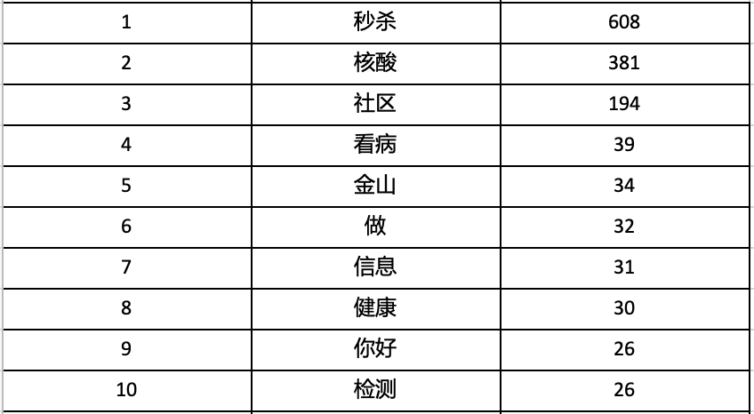
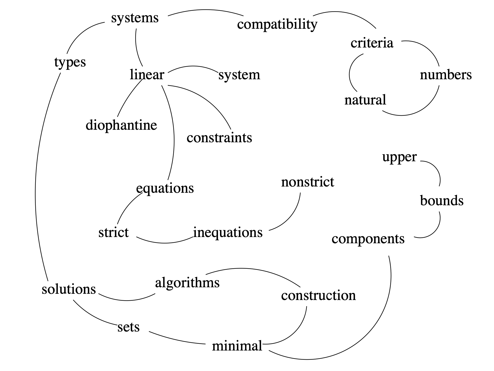
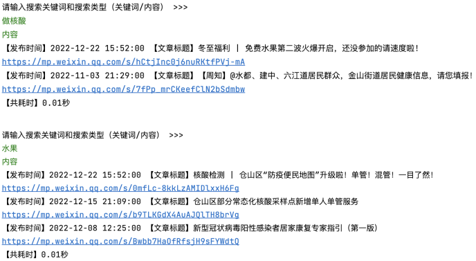

# A Keyword-Extraction-Algorithm Based Searching Method for Subscription Articles
Cheng Zheng， Jinhua Sun， Yuliang Zhang， Yejia Liu  

2023/1/11

--------------------------------
## Background
--------------------------------
"**问需金山**" is a subsciption serving residents of Jinshan community in Fuzhou. It can help people learn about epidemic prevention policies, nucleic acid sites and other important information by pushing articles:  

   
Providing benefits such as free fruit and medicine:  
   
At the same time, it also has a "**你呼我应**" platform to understand people's situation and solve people's difficulties:  
   
which provides people with convenience.  

However, after our team actually used the official account, we found that there are two functions worth improving inside the official account. First, the information articles in the "convenience service" mini program lack search function, and can only be sorted by time, as shown in the figure:  
  
It is not easy for people to look up important articles in the past. At the same time, the problem may become more prominent in the future as the number of articles increases.

Secondly, the function of "follow automatic reply" provided by the chat interface of the official account is not perfect. At present, users can only get corresponding tweets by inputting the two keywords of community and nucleic acid:  
  
while other keywords can only get fixed replies as shown in the figure.  
  
It was found that many of the keywords people entered in the chat box did not get the desired tweets:  
  
which also shows that the user support for this feature is actually very high.

Based on this, our team determined our project objectives. On the one hand, it is to realize the search function of information articles in the "convenience service", on the other hand, it is to realize the expansion of the keyword database of "Pay attention to automatic reply", both of which require us to achieve **automatic keyword extraction**, which is the core of our whole project.

## Core Concept Explanation

This part will be an explanation for all the concepts used in this project.

### Supervised algorithm

Keyphrase Extraction (KPE, or Keyword Extraction) can automatically extract phrases from an article and can summarize the core content in the document, which is beneficial to downstream information retrieval and other tasks. Keyword extraction uses machine learning, artificial intelligence (AI) with natural language processing (NLP) and there are mainly two methods for keyword extraction, **supervised** and **unsupervised** learning methods.

For **unsupervised learning** like TF-IDF, TextRank and LDA, they mainly focus on statistical information of the article, while for **supervised learning** such as SVM, K-means, and Naive Bayes, labeling and supervising play a more important role.

At present, **unsupervised** keyword extraction is more widely used in practical applications due to less consumption of resources and manpower. However, due to the difference between the length of candicate words and document sequences, the representation of key phrase candidates and documents does not match, resulting in poor performance in long documents.

In our project, we use [**TextRank**](https://www.researchgate.net/publication/200042361_TextRank_Bringing_Order_into_Text) as simple keyword extraction for subscription articles, which can exhibit a relatively good performance comparing to human's work.

#### TF-IDF

The first keyword extraction algorithm is [**TF-IDF**](https://www.researchgate.net/publication/228818851_Using_TF-IDF_to_determine_word_relevance_in_document_queries). Through **Term Frequency** and **Inverse Document Frequency**, we can infer which words may be the key words of the article. The general equation for TF-IDF is
$$
w_d=f_{w, d} \times \log \left(\frac{|D|}{f_{w, D}}\right)
$$
while $d$ means a single document and $D$ means document corpus. For the weight $w$ of each word, it not only considers the word frequency in the **current** document, but also considers the word frequency in the **whole** corpus. Therefore, words such as **articles** and **pronouns** can be screened out from the list of key words

In python coding, we import `jieba` package and implement the algorithm easily. In order to see the result of the algorithm, we use [this](https://mp.weixin.qq.com/s/JqxjRVQxflbb8J-oXM5nFw) article as a testcase to demonstrate the idea of the algorithm, and below is our test results. Notice that there is a *weight* colume on the right, which indicates the **probability** of each word to become a keyword in the article.

| Keyword | weight              |
| ------- | ------------------- |
| 金山    | 0.33799462145286435 |
| 疫情    | 0.2844514062364321  |
| 防控    | 0.2538705144310553  |
| 11      | 0.24029683422914572 |
| 问需    | 0.1802226256718593  |
| 0591    | 0.1802226256718593  |
| 街道    | 0.17984414613517588 |
| 居民    | 0.14645312820025128 |
| 配合    | 0.12727199977025128 |
| 2022    | 0.12014841711457286 |
| 12      | 0.12014841711457286 |
| 38      | 0.12014841711457286 |
| 战役    | 0.12014841711457286 |
| 醉美    | 0.12014841711457286 |
| 仓山    | 0.12014841711457286 |
| 朋友    | 0.11752981875055277 |
| 全体    | 0.10694243655648242 |
| 防疫    | 0.10018946753015076 |
| 大家    | 0.09791958812201006 |

However, there is a main **problem**: the corpus used in the inverse document frequency of TF-IDF is not fully applicable to this project, and **Arabic numerals** may appear, so we do not use this algorithm.

#### TextRank

We actually use the [**TextRank**](https://www.researchgate.net/publication/200042361_TextRank_Bringing_Order_into_Text) algorithm. It is based on [graph theory](https://www.geeksforgeeks.org/mathematics-graph-theory-basics-set-1/). Graphs contain **vertices** and **edges**, which represent **lexical units** and **relationships** between different words in an article. Below is an example graph of words and their relationships.

The core concept of **TextRank** algorithm is "**voting**" or "**recommending**". **==Notice==** that the importance of the vertex determines the importance of the edge connected to the vertex. Here is a brief explanation for TextRank algorithms.
$$
S\left(V_i\right)=(1-d)+d \times \sum_{j \in \ln \left(V_i\right)} \frac{1}{\left|O u t\left(V_j\right)\right|} S\left(V_j\right)
$$
We use relationship between connected vertices and calculate them iteratively with a set of initial values assigned to each vertex. Also note that the initial value does not influence the ultimate result of the algorithm.

TextRank mainly including the following steps.

+ To add the determined keyword as a vertex to the graph according to the lexical unit, and then connect the vertex according to the **relationship** between the two words. 

+ Perform iterative calculation until convergence
+ Rank the vertices according to the vertex score to obtain the ranking of keywords

Also, using the [article](https://mp.weixin.qq.com/s/JqxjRVQxflbb8J-oXM5nFw) mentioned above, we can have the TextRank keywords for the article.

| Keyword | weight              |
| ------- | ------------------- |
| 疫情    | 1.0                 |
| 防控    | 0.8950253329225641  |
| 配合    | 0.5923748399190941  |
| 街道    | 0.5009298772676438  |
| 居民    | 0.48506052741948785 |
| 大家    | 0.45676645755077533 |
| 朋友    | 0.41273400068681554 |
| 全体    | 0.3761215829871847  |
| 仓山    | 0.2987042528549764  |
| 工作    | 0.290975951924855   |
| 做好    | 0.28282564380346414 |
| 防疫    | 0.2776601659796551  |
| 得益于  | 0.2725217800096617  |
| 热线    | 0.26051725373979934 |

In our project, we collected **26** tweets from the subscription from 问需金山, and the time range was September to December.

### Synonym

Thesaurus

However, there is a problem with the above two algorithms that they cannot query **synonyms**. Therefore, we have introduced [**cnsyn**](https://gitee.com/vencen/Chinese-Synonyms) to build synonym thesaurus using **Wikipedia** and **Chinese synonym dictionary**. When the user enters the query word, search the synonym of the word in the inverted index according to the word, and return the synonym of the input word.

## Algorithm Implementation and Results
----------------
This **flowchart** below roughly shows the implementation process of the algorithm.  
  
First, we need to **preprocess** the article, use [**TextRank**](https://www.researchgate.net/publication/200042361_TextRank_Bringing_Order_into_Text) algorithm to extract the key words of the article and record them.

We have implemented two searching methods in the project, namely, search for **article keywords** and search for **full-text content**.

In the keyword searching method, the keyword entered by the user can be used as the **substring** of the article keyword (for example, the user enters "*核酸*", and the program search contains "*做核酸*") or the **synonym** (for example, the relationship between "*抗疫*" and "*防控疫情*"), and from the perspective of relevance, the former will have higher priority in ranking than the latter.

In the content search method, the algorithm will traverse all articles and return links to articles containing the words entered by users.

Next showed four search examples. The first is **keyword searching**. After entering *防疫* and *阳* keywords. You can see that 2 and 3 articles containing relevant keywords in the database are returned here.  
  
However, it is noted that the search for keywords here takes 14 seconds, which is a long time and is not feasible in practice. This problem will be analyzed later in the paper.

The second is **full text content searching**. Input the full text of *做核酸* and *水果* to search the whole article, and also return the web links of multiple articles.  
  
Finally, we have solved the pain points mentioned at the beginning and realized the **keyword extraction** and **searching** function of the article. For example, this table represents the hot words entered by the user in the chat box of the official account. The algorithm can be introduced to **automatically respond to any keyword**.

## Analysis and Prospect
-------------
Next, I will explain the analysis of the algorithm and the future directions of improvement.

First of all, compare the keywords extracted by manual and algorithm. The figure below shows the keywords extracted by our four members for a subscription article and ranked in descending order by the number of overlaps:  
  
while this figure below shows the keywords retrieved by the algorithm and ranked by the relevance:  
  
We filtered the keywords given by the algorithm with the manually selected keywords as the criteria. Then, we can find a total of 6 keywords that are in line with each other, which  is indicated by the red bar chart on the right. In fact, the algorithm gave a total of 20 keywords, because the latter ones did not overlap and had low relevance, they were not placed in the chart. After a rough calculation, we can conclude that this algorithm has an accuracy of 30%.

At the same time, we found that the highest keyword accuracy obtained by the [TextRank](https://www.researchgate.net/publication/200042361_TextRank_Bringing_Order_into_Text) algorithm was 31.2% by searching the relevant literature, which is close to the result of 30% obtained by our algorithm. Moreover, since most of the valid keywords are concentrated in the first 10, we can increase the precision by delimiting the **keyword relevance range**, for example, by limiting the relevance to greater than 0.4. Therefore, I think the precision of the algorithm meets the requirement of use.

In terms of the efficiency of the algorithm, we found that the time for each keyword search was more than 10 seconds. This is because our search for keywords includes **synonym searching**, and the algorithm needs to cross-reference the synonyms of the search terms with the synonyms of the extracted keywords, each comparison requiring re-searching for synonyms. Furthermore, the search for synonyms requires access to multiple web resources, so the overall efficiency is much lower.

For this, our proposed solution is to build a local thesaurus and put in advance the synonyms of all article keywords, as well as the synonyms.

[Source Code](https://github.com/changyang21/stat3060-website/blob/main/main.py)
